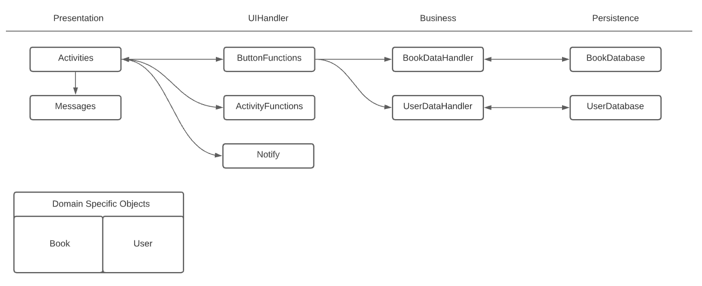

## Architecture
## Iteration 1 Diagram

## Presentation Layer
[Main Activity](https://code.cs.umanitoba.ca/3350-winter-2021-a03/winter-2021-a03-group-10/-/blob/master/app/src/main/java/com/comp3350_group10/bookstore/MainActivity.java)
- The starting page for the bookstore app, allows user to perform book search.

[Book Details Page]()
- The page that will display information detail for books. 

## Logic Layer
[UI Handler](https://code.cs.umanitoba.ca/3350-winter-2021-a03/winter-2021-a03-group-10/-/blob/master/app/src/main/java/com/comp3350_group10/bookstore/logic/UI_Handler/UIHandler.java)
- The class that contains functions corresponding to each of the buttons in UI, and passes the input from presentation layer to DataHandler.

[Data Handler](https://code.cs.umanitoba.ca/3350-winter-2021-a03/winter-2021-a03-group-10/-/blob/master/app/src/main/java/com/comp3350_group10/bookstore/logic/Data_Handler/DataHandler.java)
- The class that the passes the input from presentation layer to data layer to call for operations.